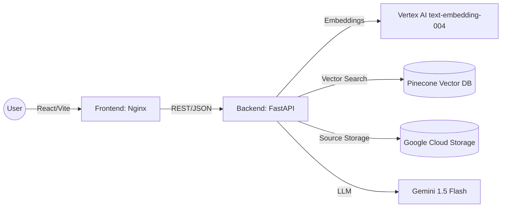

# Simple RAG: Production AI on Google Cloud

A full-stack, cloud-native Retrieval-Augmented Generation (RAG) platform. This system allows users to upload documents (PDF/TXT) to a private knowledge base and query them using Gemini 1.5 Flash, with all infrastructure hosted securely on GCP.

## 🏗️ System Architecture

The project is split into two independent, containerized microservices:

---

## 📂 Project Structure

| Directory               | Role                                                           | Tech Stack                            |
| ----------------------- | -------------------------------------------------------------- | ------------------------------------- |
| [./backend](/backend)   | The "Brain": Handles ingestion, embedding, and RAG logic.      | Python, FastAPI, LangChain, Vertex AI |
| [./frontend](/frontend) | The "Storefront": Interactive UI for users to chat and upload. | React, TypeScript, Vite, Nginx🚀      |

---

## Deployment Strategy: The "Double Cloud Run"

Both services are deployed as individual **Cloud Run** containers. This allows them to scale independently—saving costs when the AI isn't in use while staying responsive for UI visitors.🔐

### The Connectivity Handshake (CORS)

Because the services live at different URLs, we implemented **Cross-Origin Resource Sharing (CORS)**:

1. **Frontend URL**: Assigned by Google (https://simple-rag-frontend-735784896762.europe-west1.run.app/).
2. **Backend Trust**: The Backend is configured to trust the Frontend URL, allowing the browser to safely send "Ask AI" requests without being blocked by security policies.

### 🛡️ Production Hardening

- **Non-Root Users**: Both containers run as restricted users, meaning they have no administrative access to the underlying server.
- **Service Accounts**: The Backend uses a dedicated IAM Service Account to access Vertex AI and GCS, avoiding the need to bake sensitive JSON keys into the image.
- **Secret Manager**: The Pinecone API key is injected at runtime from Google Secret Manager.

---

## 🛠️ Global Setup & Orchestration

### 1. Networking Configuration

Both services are configured to communicate over Port 8080 (for Frontend Nginx) and Port 8000 (for Backend FastAPI). Cloud Run handles the public HTTPS mapping automatically.

### 2. Environment Variables

To connect the services, the Frontend must be built with the Backend's live URL:

- Local: http://localhost:8000
- Production: https://simple-rag-service-735784896762.europe-west1.run.app3.

### Bulk Build & Push

To update the entire system at once, build images for frontend and backend via the Dockerfile in each folder and push to GCP Artifact Registry, then in gcp swap the images for the services and redeploy (see the frontend and backend README linked below for detailed steps)

---

## 🧠 Key Design Principles

- **Idempotent Ingestion**: We use Deterministic IDs (SHA-256 hashes of content) so that if you upload the same document twice, the system recognizes it and skips redundant embedding costs.
- **Declarative UI**: React manages the "Lifecycle of a Request," disabling buttons during "thinking" states to prevent backend spamming.
- **Stateless Scaling**: Neither service stores data on its own local disk; everything is persisted in Pinecone or Google Cloud Storage, allowing the app to scale to 100+ instances instantly.

---

## 📖 Sub-Module Documentation

For specific implementation details, installation steps, and API docs, refer to the individual READMEs:

- 👉 [Backend Documentation](./backend/README.md) - RAG logic, Chunking strategies, and GCP setup.
- 👉 [Frontend Documentation](./frontend/README.md) - React state management, Vite setup, and Nginx configuration.
